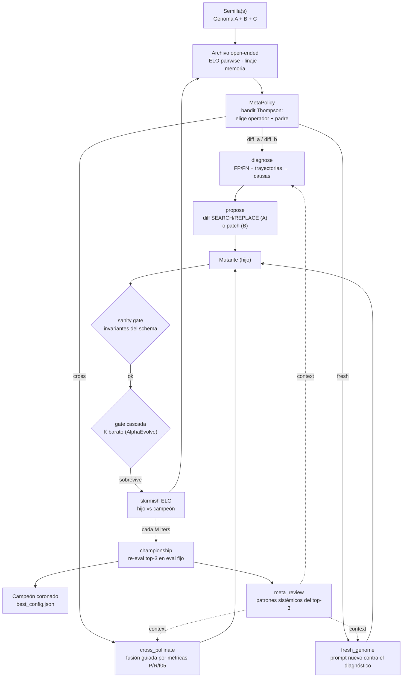
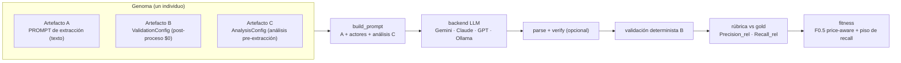

# text2graph-evolve

**Extracción de grafos políticos signados con auto-mejora evolutiva basada en LLM.**

Optimiza iterativamente un extractor de relaciones políticas chilenas (texto → grafo
signado) mediante un loop evolutivo estilo *RoboPhD* / *GEPA*: un **genoma de 3 artefactos**,
**ELO pairwise**, un **archivo open-ended** (Darwin-Gödel Machine), validación determinista
de costo cero y *fitness* F0.5 *price-aware* con piso de recall graduado.

La novedad clave: el sistema no solo evoluciona el extractor, sino que sus **meta-agentes**
(diagnose / propose / cross / fresh / meta_review) tienen **system prompts robustos estilo
GEPA**, versionados y testeados, que reflexionan sobre trayectorias de error para proponer
mutaciones — replicando lo que un experto haría a mano.


---

## Arquitectura

### 1. El loop evolutivo (`loop.py`)

Cada iteración: el bandit elige un operador y un padre; el operador produce un mutante; el
mutante pasa por gates baratos antes de un *skirmish* ELO contra el campeón; cada *M*
iteraciones un *championship* re-evalúa el top y corona.



### 2. El genoma y su evaluación (`extractor.py` + `rubric.py`)

Un individuo es un genoma de 3 artefactos. Para puntuarlo se corre la extracción sobre un
sub-muestreo y se compara contra el gold.



### 3. Los meta-agentes y sus prompts (`prompts/`)

El "Evolution AI" son 5 meta-agentes LLM. Cada uno vive en su módulo dentro de `prompts/`
con un **SYSTEM prompt robusto** (rol + tarea + formato + invariantes) separado del mensaje
**USER** dinámico (el contexto de la iteración). Un `PromptSpec` por agente define el
*rubric* de calidad que los tests verifican sin costo de API.

| Meta-agente | Qué hace | Contexto que recibe (USER) |
|---|---|---|
| **diagnose** | FP/FN → 3-5 causas de clase (DIRECCIÓN/PRECISIÓN/RECALL) | errores **con trayectoria** (evidence_quote) |
| **meta_review** | patrones sistémicos transversales del top-3 | FP/FN agregados |
| **propose** | el motor de mutación: un cambio quirúrgico en A o B | diagnóstico + memoria del linaje + ejemplos-trayectoria + genoma |
| **cross_pollinate** | fusiona dos prompts top | ambos prompts **+ sus métricas P/R/f05 + diagnóstico** |
| **fresh_genome** | diseña un extractor nuevo desde cero | top-2 + **diagnóstico + patrones del meta-revisor** |

> Los `cross` y `fresh` antes trabajaban **a ciegas** (solo recibían los dos prompts). Ahora
> reciben métricas y diagnóstico — la causa raíz por la que el self-evolve no replicaba las
> mutaciones propuestas a mano. Ver `docs/superpowers/specs/2026-06-15-agent-prompt-quality-design.md`.

---

## Estructura del repositorio

```
text2graph-evolve/
├── swarm_optimizer/              # paquete principal
│   ├── loop.py                   # loop evolutivo: ELO skirmish + championship anclado
│   ├── genome.py                 # Genoma: Artefacto A (prompt) + B (validation) + C (analysis)
│   ├── mutate.py                 # orquesta meta-agentes + funciones puras (diff/patch/merge)
│   ├── prompts/                  # ★ system prompts robustos por agente (fuente única)
│   │   ├── base.py               #     PromptSpec (rubric: estructura + contexto)
│   │   ├── diagnose.py · meta_review.py · propose.py · cross.py · fresh.py
│   │   ├── extract.py · verify.py#     specs de cobertura (agentes-tarea)
│   │   └── _authored.py          #     textos SYSTEM_* (autorados por workflow, regenerables)
│   ├── archive.py                # archivo open-ended (DGM): linaje + memoria retrospectiva
│   ├── meta_policy.py            # bandit Thompson sobre operadores de mutación
│   ├── extractor.py              # build_prompt + llamada LLM + parseo + verificación agéntica
│   ├── llm_backends.py           # 4 backends: Gemini/Claude/GPT/Ollama (split system/user)
│   ├── analysis.py               # Artefacto C: análisis determinista pre-extracción
│   ├── validation.py             # Artefacto B: post-proceso determinista (costo $0)
│   ├── fitness.py · rubric.py · elo.py · splits.py   # scoring, métricas, ELO, splits
│   ├── run.py                    # CLI principal
│   └── tests/                    # 225 tests
├── scripts/                      # report_run.py, propose_mutations.py, synth_evolve.py, ...
├── docs/                         # specs, planes e informes de arquitectura
├── results/                      # salidas de corridas (gitignore selectivo, ver abajo)
├── requirements.txt · LICENSE · CLAUDE.md · README.md
└── sandbox/                      # scratch local (gitignoreado)
```

---

## Instalación

```bash
pip install -r requirements.txt
```

Crea un `.env` en la raíz con tu clave (el backend default es Gemini):

```
GEMINI_API_KEY=tu-api-key
```

Backends alternativos (el SDK se importa de forma perezosa, instala solo el que uses):

```bash
python -m swarm_optimizer.run --llm anthropic --model claude-sonnet-4-6   # Claude
python -m swarm_optimizer.run --llm openai    --model gpt-5.4-mini         # GPT
# Ollama local (sin costo de API):
ollama serve && ollama pull qwen2.5:7b
python -m swarm_optimizer.run --llm ollama
```

---

## Uso rápido

```bash
# 1. Verificar que el pipeline funciona (~$0.001) antes de gastar presupuesto
python -m swarm_optimizer.run --probe

# 2. Corrida estándar (20 iteraciones, presupuesto $8)
python -m swarm_optimizer.run --iterations 20 --budget 8.0

# 3. Multi-seed: siembra 3 variantes y deja competir (base + verify + debate)
python -m swarm_optimizer.run --iterations 20 --budget 8.0 --multi-seed

# 4. Con meta-agente (bandit Thompson sobre operadores)
python -m swarm_optimizer.run --iterations 40 --budget 8.0 --meta-policy

# 5. Reporte de la última corrida (histograma de recall, stats por operador, gap Goodhart)
python scripts/report_run.py -o results/swarm/reporte.md

# 6. Tests
python -m pytest swarm_optimizer/tests/ -q       # 225 passed
```

---

## Catálogo de mutaciones

El genoma tiene tres artefactos; el Evolution AI elige uno por iteración.

### Artefacto A — Prompt (operadores `diff_a` / `fresh` / `cross`)

El LLM emite un diff SEARCH/REPLACE sobre el prompt actual. Dimensiones mutables:

| Dimensión | Ejemplo de mutación |
|---|---|
| **Regla de existencia de relación** | "requiere verbo conector explícito entre los actores" |
| **Definición de dirección** | más ejemplos pasiva → activa ("fue criticado por" → from=crítico) |
| **Descripción de act_types** | clarificar `endorses` vs `allies_with`, cuándo NO usar `co_occurs` |
| **Regla de evidence_quote** | "mínimo 15 palabras del texto original" |
| **Arquitectura de razonamiento** | debate interno: proponer → objetar → emitir solo las que sobreviven |
| **Few-shot / co-referencia / issues** | ejemplos, manejo de alias, temas permitidos |

### Artefacto B — ValidationConfig (operador `diff_b`, post-proceso determinista, $0)

| Campo | Base | Qué controla | Dirección esperada |
|---|---|---|---|
| `require_evidence_substring` | `True` | descarta citas que no aparecen literalmente | rara vez `False` |
| `min_quote_len` | `8` | descarta citas muy cortas (ruido) | `12`–`20` → +precisión / -recall leve |
| `normalize_passive_direction` | `True` | invierte "A fue atacado por B" → from=B | desactivar si invierte mal |
| `enforce_polarity_consistency` | `False` | descarta polaridad incoherente con el act_type | activar ante FP imposibles |
| `allowed_act_types` | lista | filtra tipos no autorizados | quitar `co_occurs` si genera FP |
| `max_relations_per_article` | `None` | corta explosión de relaciones | `15`–`20` en artículos largos |
| `min_confidence` | `None` | umbral ordinal (explicit/implied/speculative) | `0.7` descarta speculative |
| `require_both_in_quote` | `False` | ambos actores deben estar en la cita | activar ante FP de co-presencia |

### Artefacto C — AnalysisConfig (análisis determinista pre-extracción, $0)

Flags que gatean secciones del bloque de análisis que se inyecta al prompt: dossier de
actores, mapa de alias, *role hints*, *scaffold* de dirección, *main speaker*, pares de
co-mención, canonicalización de act_type y *gating* de dominio.

---

## Métricas clave

| Métrica | Descripción |
|---|---|
| `Precision_rel` | de las relaciones emitidas, % correctas |
| `Recall_rel` | de las relaciones gold, % encontradas |
| `f05` | F0.5 (pondera precisión 2× sobre recall) — objetivo principal |
| `Polarity_acc` | % de polaridades correctas |
| `championship_score` | fitness sobre eval completo (anclado, referencia estable) |
| `fitness_delta` | margen del hijo vs campeón en skirmish (señal del bandit) |

---

## Datos y licencia

- **Código:** MIT (ver [`LICENSE`](LICENSE)).
- **Corpus y gold standard (`gold_standard_v5/`):** licencia **IMFD**, **NO** versionado
  (ver `.gitignore`). Necesario para `loop.py` y `rubric.py`; configúralo como junction/symlink:
  ```powershell
  New-Item -ItemType Junction -Path ..\gold_standard_v5 -Target "C:\ruta\real\gold_standard_v5"
  ```
- **Importante para publicar:** las salidas en `results/` y el historial de git pueden
  contener `evidence_quote` (texto literal del corpus IMFD). Para un repo público usa el
  *slate limpio* descrito en [`PUBLISHING.md`](PUBLISHING.md), que excluye corpus y datos.

---

## Insights destacables

- **El cuello histórico fue `Precision_rel`**, no el recall. Las entidades se extraen bien
  (~80%); el problema eran demasiadas relaciones falsas — sobre todo `co_occurs` espurios
  entre entidades del mismo párrafo sin verbo conector.
- **Las primeras mutaciones ganadoras suelen ser `diff_b`** (artefacto B, costo $0): subir
  `min_quote_len` o restringir `allowed_act_types` da mejoras rápidas de precisión.
- **El piso de recall es crítico.** Sin él, el sistema optimiza precisión forzando recall a 0
  (no emitir nada = 0 FP). La penalización graduada evita ese colapso.
- **Lenguaje coloquial chileno** baja la precisión del LLM; las fuentes formales producen
  grafos más limpios.

---

## Documentación

- [`CLAUDE.md`](CLAUDE.md) — guía para trabajar el repo con agentes.
- [`docs/superpowers/specs/`](docs/superpowers/specs/) — specs de diseño (rediseño evolutivo,
  calidad de prompts, gold sintético).
- [`docs/`](docs/) — informe de arquitectura auto-evolutiva y roadmap.
